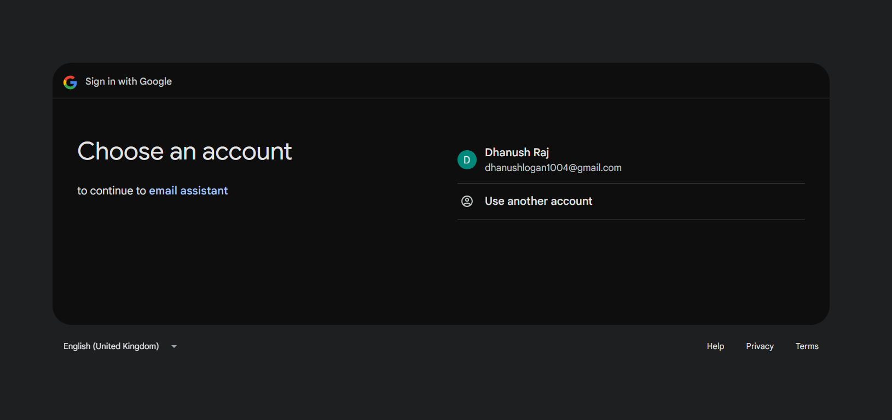
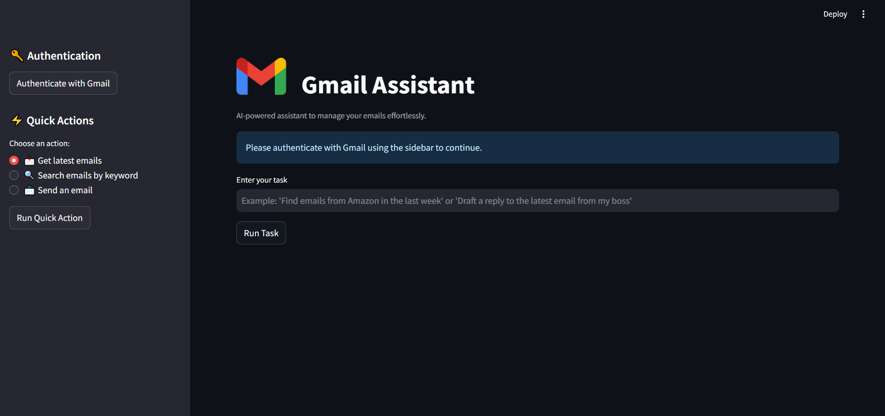
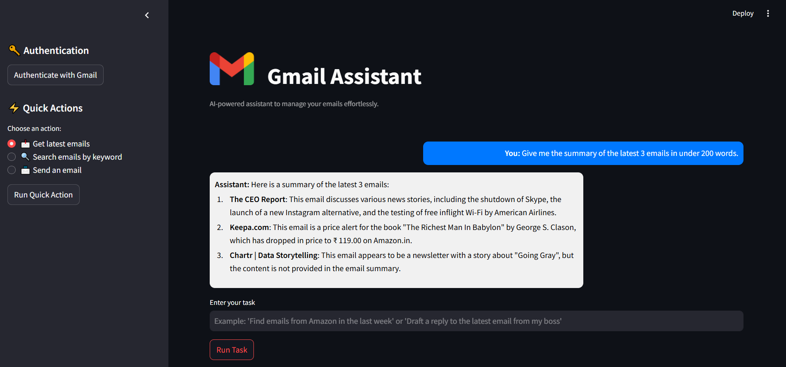

<h1 align="center"> 📧 Gmail Assistant </h1>

<p align="center">
  
  
  
  
</p>

<h3 align="center"> End to End AI Agent Project: "AI-powered Gmail assistant for reading, searching, sending, and managing emails efficiently" </h3>

<br>

## 🚀 Live Applicaiton
🌐 The application is deployed and live  
  
> 👉 [Access the web app here](https://gmail-assistant-project.streamlit.app/)  
  
> [!NOTE]  
> The web app may take 1-2 minutes to load.  
  
> [!TIP]  
> For the best experience, please refer to the [Usage Guide](#-usage-guide) section below to learn how to navigate and use the web app effectively.
  
<br>
## 🚀 Project Overview
- The Gmail Assistant is an AI-driven application that helps users interact with their Gmail accounts using natural language. Built with Agno AI (formerly Phidata), Groq LLM, and Streamlit. 
- The assistant utilizes Google OAuth 2.0 for authentication and interacts with the Gmail API to fetch and manage emails securely.
- It allows users to:  
    📩 Read emails – Retrieve and summarize recent emails.  
    🔍 Search emails – Find emails based on keywords, sender, or date.  
    ✉ Send emails – Compose and send emails via Gmail.  
    📂 Manage emails – Handle spam, categorize emails, and more.  

<br>

## 🎯 How the Project Works
### User Authentication:
The user authenticates with Gmail via OAuth 2.0.
The app retrieves an access token to interact with Gmail services.

### Query Processing:
The user enters a request (e.g., "Find my latest emails from John").
The input is processed and passed to the Groq-powered LLM.

### AI-driven Response:
The AI agent interprets the query, calls the Gmail API, and retrieves relevant data.
A structured response is generated and displayed in the UI.

### Chatbot UI:
The web-based UI (built with Streamlit) allows users to interact seamlessly.
User queries appear on the right, and assistant responses appear on the left, resembling a real chatbot.

<br>

## 🛠️ Tech Stack
| Technology | Description |
|------------|-------------|
| **Python** | Programming language used  |
| **Streamlit** | Web framework for UI of the assistant |
| **Agno AI (formerly Phidata)** | AI framework for building agents and tools |
| **Groq LLM** | LLM for natural language processing |
| **Google OAuth 2.0** | User authentication for using the gmail assistant  |
| **Gmail API** | Email retrieval and management |


<br>

## 📂 Project Structure
```
/📂 Gmail-Assistant
├── /📂 static                 # Static assets (images, styles)
│   ├── gmail-logo.png         # Logo for UI
├── /📂 rough                   # Research and rough work purpose
|    ├── rough.py               # rough python file 
├── /📂 src                     # Source code
│   ├── assistant_builder.py   # Core AI logic for Gmail operations
│   ├── /📂 utils
│   │   ├── exception.py     # Custom exception handling
|   |   ├── helper.py        # Google Oauth authentication
├── Pipfile                  # Dependencies (Pipenv)
├── Pipfile.lock             # Locked dependencies
├── requirements.txt         # List of required libraries, modules, dependencies
├── .env                     # Environment variables (OAuth keys)
├── README.md                # Project documentation
```

<br>

## 🚀 Setup & Installation

### Prerequisites  
Gmail API enabled with OAuth 2.0 credentials  
Pipenv (for managing dependencies)  

## Installation Steps

### 1️⃣ Clone the repository:

```sh
git clone https://github.com/Dhanush-Raj1/Gmail-Assistant-Project.git
cd Gmail-Assistant-Project
```

### 2️⃣ Set up a virtual environment:

```sh
pipenv install
pipenv shell
```

### 3️⃣ Configure environment variables:

Create a .env file and add your credentials:
```
GROQ_API_KEY=your_groq_api_key
GOOGLE_CLIENT_ID=your_google_client_id
GOOGLE_CLIENT_SECRET=your_google_client_secret
GOOGLE_PROJECT_ID=your_project_id
GOOGLE_REDIRECT_URI=your_redirect_uri
HF_TOKEN_LLAMA=your_huggingface_token
```

### 4️⃣ Run the application:

```
streamlit run app.py
```

<br>

## 📝 Usage Guide  

[Access the web app](https://gmail-assistant-project.streamlit.app/)

### 🔹 Step 1: Authenticate with Gmail  
- Click on the **"Authenticate with Gmail"** button on the sidebar.  
- Sign in with your **Google account** and click **Select ALL** to grant all the necessary permissions.
- The web app will be directed, click the **Authenticate with Gmail** button once again.  

### 🔹 Step 2: Chat with your Inbox
### *Chat with the assistant in natural language*

> [!NOTE]  
> ** Give me the summary of my 3 latest emails in under 100 words**  
> ** Find me the recent 2 emails related to invoice**  
> ** Send an email to `<sender_email>` saying I'm free on Wednesday at 4:30 PM**  
> ** Find me the latest email from `<sender_email>` and summarize in 100 words**
  
### 🔹 Quick Actions:
### *Play with the quick actions button from the side bar*
#### 📩 **Retrieve Latest Emails**  
- Click **"Get Latest Emails"** to get the most recent messages.  
- The assistant will return **Sender, Subject, and Received Time** (converted to IST).  

#### 🔍 **Get unread emails**  
- Click **"Get unread emails"** to get a summary of the latest unread emails 

#### **Search emails by keyword**
- Click **"Search emails by keyword** to get emails related to specific keywords
- Eg: Search for emails related to 'invoice'

#### ✉️ **Send an Email**  
- Click **"Send an email"** to send an email to a person and you can enter the subject.  
- The assistant will send the email with a **structured format and a signature**.  

<br>

## 🖼️ Screenshots
✨ Authentication Page  
  
<br>
✨ Chatbot Interface    
  
<br>
✨ Email Summarization    
  

<br>

## 🚀 Future Enhancements  

🔹 **Memory-Based Conversations**  
Store chat history using a vector database (FAISS or PostgreSQL).  

🔹 **Priority-Based Email Sorting**  
Categorize emails using **AI-driven importance detection**.  

🔹 **Sentiment Analysis for Emails**  
Analyze email tone (positive, neutral, negative) before responding.  

🔹 **Voice Commands Integration**  
Allow users to interact via voice instead of text input.  

🔹 **Multi-Account Support**  
Enable switching between multiple Gmail accounts.  

🔹 **Mobile App Version**  
Build a **React Native or Flutter app** for better mobile accessibility.  

<br>

## 🤝 Contributing
💡 Have an idea? Feel free to contribute or open an issue and pull requests! 

## 📜 License
This project is licensed under the MIT License. Click to see the [LICENSE](LICENSE). 
